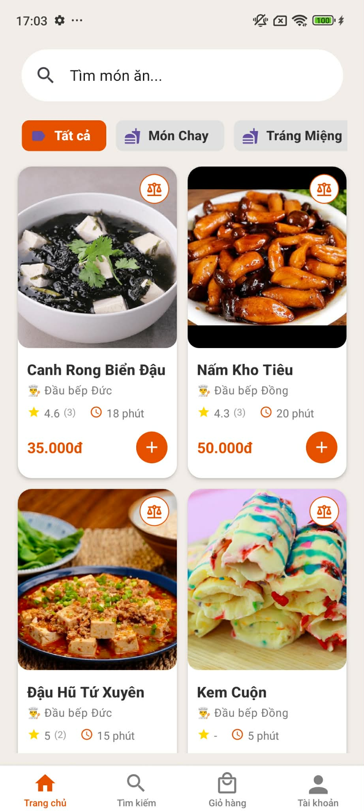
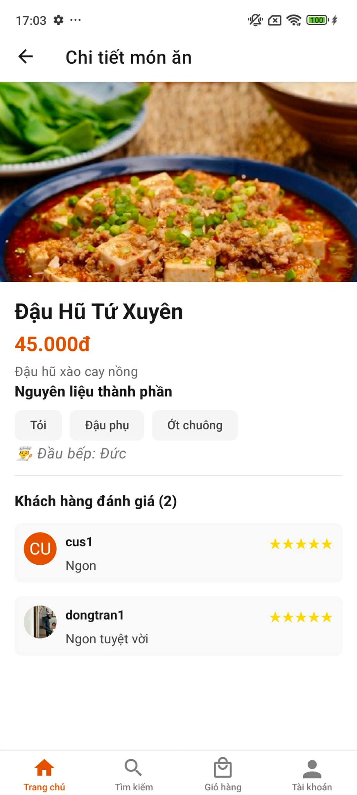
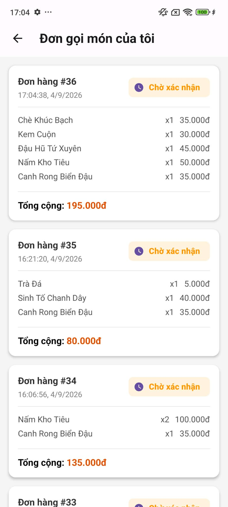

# Hệ thống quản lý nhà hàng trực tuyến

Ứng dụng mobile hỗ trợ khách hàng đặt món, đặt bàn và theo dõi đơn hàng. Hệ thống đồng thời cung cấp chức năng quản lý món ăn, đánh giá và thống kê cho đầu bếp.

## Hình ảnh ứng dụng

<table>
  <tr>
    <td></td>
    <td></td>
    <td></td>
  </tr>
  <tr>
    <td align="center">Trang chủ</td>
    <td align="center">Chi tiết món ăn</td>
    <td align="center">Đơn gọi món</td>
  </tr>
</table>

## Chức năng chính

### Khách hàng

* Đăng ký, đăng nhập và duy trì phiên đăng nhập.
* Xem, tìm kiếm và lọc món ăn theo danh mục.
* So sánh hai món ăn cùng danh mục.
* Thêm món vào giỏ hàng và thay đổi số lượng.
* Chọn thời gian, số khách và đặt bàn.
* Thanh toán tiền mặt trong luồng mô phỏng.
* Xem lịch sử đặt bàn và đơn gọi món.
* Đánh giá món ăn sau khi đơn hoàn thành.

### Đầu bếp

* Đăng nhập sau khi được quản trị viên phê duyệt.
* Thêm, sửa và xóa món ăn.
* Tải hình ảnh món ăn lên Cloudinary.
* Xem đánh giá của khách hàng.
* Theo dõi thống kê món ăn và doanh thu.

### Quản trị viên

* Quản lý tài khoản, món ăn, danh mục, đơn hàng và đặt bàn.
* Phê duyệt tài khoản đầu bếp thông qua Django Admin.

## Công nghệ sử dụng

| Thành phần    | Công nghệ                         |
| ------------- | --------------------------------- |
| Mobile        | React Native, Expo SDK 54         |
| Giao diện     | React Native Paper                |
| Điều hướng    | React Navigation                  |
| Quản lý state | Context API, `useReducer`         |
| Gọi API       | Axios                             |
| Backend       | Django, Django REST Framework     |
| Xác thực      | SimpleJWT                         |
| Cơ sở dữ liệu | MySQL, hỗ trợ SQLite khi chạy thử |
| Lưu hình ảnh  | Cloudinary                        |

## Xác thực người dùng

Backend phát `access token` và `refresh token` khi đăng nhập. Axios tự gắn access token vào các API cần xác thực và tự làm mới token khi hết hạn.

Khi mở lại ứng dụng, phiên đăng nhập được khôi phục từ AsyncStorage. Khi đăng xuất, refresh token được đưa vào blacklist để không thể tiếp tục sử dụng.

## Cấu trúc dự án

```text
HeThongQuanLyNhaHangTrucTuyen/
├── restaurant_project/    # Backend Django REST Framework
├── restaurantapp/         # Ứng dụng React Native
└── README.md
```

Frontend được chia thành:

```text
restaurantapp/
├── components/    # Component dùng chung
├── configs/       # Axios, endpoint và Context
├── reducers/      # State người dùng và giỏ hàng
├── screens/       # Các màn hình Customer và Chef
├── styles/        # Style dùng chung
└── App.js         # Navigation và Provider
```

## Cách chạy backend

```cmd
cd restaurant_project
python -m venv .venv
.venv\Scripts\activate
python -m pip install -r requirements.txt
copy .env.example .env
python manage.py migrate
python manage.py runserver 0.0.0.0:8000
```

Cập nhật thông tin database và Cloudinary trong `.env`.

## Cách chạy ứng dụng mobile

```cmd
cd restaurantapp
npm install
copy .env.example .env
npx.cmd expo start --clear
```

Cấu hình địa chỉ backend trong `restaurantapp/.env`:

```env
EXPO_PUBLIC_API_URL=http://IP_MAY_TINH:8000/
```

Điện thoại và máy tính phải kết nối cùng mạng Wi-Fi khi chạy trên thiết bị thật.

## Kiểm tra dự án

```cmd
python manage.py check
npx.cmd expo-doctor
```

Các luồng Customer và Chef đã được kiểm tra thủ công trên Android.

## Phạm vi hiện tại

Dự án hiện hỗ trợ thanh toán tiền mặt trong môi trường thử nghiệm. Thanh toán trực tuyến, đăng nhập mạng xã hội và chat thời gian thực chưa được triển khai.
